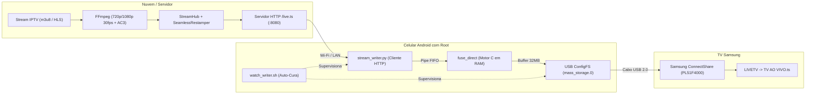

# USB Stream TV — Infinite Live IPTV on Legacy Non-Smart TVs via Emulated USB Mass Storage

> **Engenharia Reversa & Implementação Completa de Streaming Contínuo para TVs Sem Conexão de Rede**  
> Desenvolvido e validado com sucesso em uma TV de Plasma Samsung PL51F4000 (ConnectShare USB 2.0) usando um Xiaomi Mi A2 (`jasmine_sprout`) com root.

---

## 📺 1. O Desafio e a Visão do Projeto

Televisores antigos (como as lendárias TVs de Plasma Samsung das séries D, E e F, fabricadas entre 2011 e 2014) oferecem excelente qualidade de imagem, mas **não possuem Wi-Fi, Ethernet ou sistema Smart TV**. O único meio de entrada digital além das portas HDMI é a porta **USB ConnectShare**.

O reprodutor **ConnectShare** foi projetado exclusivamente para reproduzir **arquivos estáticos em pendrives FAT32/NTFS** (como filmes em `.mkv` ou `.mp4`). Ele **nunca** foi concebido para transmissões de TV ao vivo.

### A Solução
Transformamos um smartphone ou tablet Android antigo com root em um **Pendrive Virtual Inteligente** que emula um disco USB Mass Storage de 4 GB diretamente na memória RAM (via FUSE). 
* Um servidor central (na VPS ou PC) transcodifica canais IPTV ao vivo para o formato nativo de hardware da TV (H.264 720p/1080p a 30fps com áudio Dolby Digital AC3).
* O celular recebe o fluxo de rede e o serve em tempo real para a TV como se fosse um arquivo `.ts` comum.
* O usuário troca de canal através de um controle remoto web no próprio smartphone, e a TV muda de canal instantaneamente sem fechar o reprodutor de vídeo!

---

## 🚀 2. Os 8 Grandes Breakthroughs Técnicos

Durante o desenvolvimento deste projeto, superamos diversas barreiras de hardware e software que tornaram o projeto viável:

### 1. FUSE Direct em RAM (Zero Desgaste de Memória Flash)
* **O Problema:** Gravar 2.5 Mbps de vídeo continuamente na memória flash interna do celular causaria engasgos de I/O e destruiria o chip de memória eMMC/UFS em poucos meses devido ao limite de ciclos de escrita.
* **A Solução:** Criamos o motor `fuse_direct.c` em C estático. Ele sintetiza um disco virtual FAT32 de 4 GB **100% na memória RAM**. Os setores do vídeo são servidos sob demanda a partir de um anel circular (*ring buffer*) de 32 MB. **Zero bytes são gravados na memória física do aparelho**.

### 2. Superação da Sonda do ConnectShare ("Nenhum Arquivo de Vídeo Encontrado")
* **O Problema:** Antes de exibir qualquer vídeo na lista, o player ConnectShare da Samsung realiza leituras de validação de contêiner lendo nos primeiros 10% do arquivo e próximo ao final (EOF). Se essas leituras retornarem zeros ou pacotes nulos (0x1FFF), a TV declara o arquivo inválido e exibe *"Nenhum arquivo de vídeo encontrado"*.
* **A Solução:** No `fuse_direct.c`, qualquer leitura fora dos limites imediatos da transmissão ao vivo é respondida servindo blocos válidos e cíclicos de pacotes MPEG-TS do próprio anel de RAM. A TV valida os cabeçalhos com sucesso e aceita o vídeo imediatamente.

### 3. Correção do Estouro de Inteiro de 32-bits no FAT32
* **O Problema:** Definir o arquivo virtual com tamanho de 4.29 GB (`0xFFFFD000`) causa *integer overflow* no campo `DIR_FileSize` de implementações de FAT32 de 32 bits com sinal, resultando em um tamanho negativo (`-24.576 bytes`), travando o leitor da TV.
* **A Solução:** Fixamos o tamanho virtual do arquivo `TV AO VIVO.ts` em **1.800.000.000 bytes (~1.8 GB)** com 2.3 GB de espaço livre relatado no setor FSInfo (`gen_template.py`), o que é 100% seguro para qualquer firmware FAT32 legado.

### 4. Modo de Reprodução Infinita (`00:05 / 00:05`)
* **O Funcionamento:** O motor FUSE bloqueia as leituras da TV na fronteira de escrita em tempo real (*1x broadcast rate*). O reprodutor ConnectShare interpreta que a cabeça de leitura chegou ao fim do arquivo virtual, mas como novos dados chegam continuamente a 30fps, a barra de progresso da TV fixa em `00:05 / 00:05` e **continua reproduzindo a transmissão ao vivo indefinidamente sem parar**.

### 5. Re-estampagem Monotônica de Timestamps (`SeamlessRestamper`)
* **O Problema:** Cada canal IPTV possui contadores de continuidade (CC), relógios PCR e marcas de tempo (PTS/DTS) completamente arbitrários. Trocar de canal causa saltos temporais bruscos, travando o decodificador de hardware ou causando desincronização labial de áudio.
* **A Solução:** O `server.py` implementa um re-estampador de pacotes MPEG-TS em tempo real:
  * PIDs fixos e universais: Vídeo em `0x100` (256), Áudio em `0x101` (257) e PMT em `0x1000` (4096).
  * Contador de Continuidade (CC) estritamente sequencial (0 a 15).
  * PCR re-ancorado a 27 MHz e PTS/DTS mapeados em um fluxo temporal contínuo sem saltos para trás.
  * Transcodificação de áudio padronizada para **Dolby Digital (AC3) 48 kHz stereo**, o formato de maior compatibilidade nas TVs Samsung.

### 6. Sincronização Atômica "Make-Before-Break"
* **O Funcionamento:** Ao trocar de canal via interface web (`/api/switch`), o canal anterior **continua transmitindo para a TV** enquanto o novo canal conecta e transcodifica os primeiros quadros em segundo plano. A substituição do fluxo é feita atomicamente no primeiro quadro decodificável (IDR/SPS), garantindo **zero tela preta, zero congelamento e zero interrupção de USB**.

### 7. Auto-Cura do Gadget USB contra Desligamento da TV
* **O Problema:** Quando a TV é desligada ou colocada em standby, o corte de energia da porta USB (queda do VBUS) faz o framework do Android restaurar o gadget USB para o modo padrão (`MTP` ou `Apenas Carregamento`), quebrando o pendrive virtual.
* **A Solução:** O watchdog `watch_writer.sh` monitora o gadget USB a cada 5 segundos. Se o Android desconectar a LUN ou desvincular o UDC, o script remonta o Mass Storage e restabelece a conexão USB automaticamente. Ao ligar a TV, o pendrive virtual já está pronto.

### 8. Amortecedor de Pacing (`LEADBACK = 12 MB`)
* **O Funcionamento:** A TV lê com uma margem de segurança de **12 MB (~40 segundos)** atrás da escrita ao vivo no anel de RAM de 32 MB. Essa folga atua como um amortecedor hidráulico perfeito, absorvendo oscilações de Wi-Fi, reconexões de rede ou latências de CDN sem que a TV sofra travamentos.

---

## 🏗️ 3. Arquitetura do Sistema



---

## 📋 4. Guia Passo a Passo de Replicação

Este guia permite que qualquer outro desenvolvedor ou agente de IA replique este projeto em um novo ambiente ou aparelho (celular/tablet antigo).

### Requisitos Mínimos

1. **Servidor (VPS ou PC Local):**
   * Linux (Ubuntu 22.04 / 24.04 recomendados).
   * FFmpeg compilado com suporte a `libx264` e `ac3`.
   * Python 3.8+.
   * Recursos: 2 vCPUs e 1 GB de RAM livres (para 720p/1080p).
2. **Dispositivo Cliente (Celular ou Tablet):**
   * Aparelho Android com acesso **Root** (Magisk ou SuperSU).
   * Suporte a USB ConfigFS com módulo `mass_storage` no kernel (comum em Android 6 a 10).
   * Aplicativo **Termux** instalado.
   * Cabo USB de boa qualidade conectado à porta USB da TV.

---

### Passo 1: Configurar o Servidor (VPS ou PC)

1. Clone o repositório no servidor:
   ```bash
   git clone https://github.com/Tatarotus/usb-stream-tv.git
   cd usb-stream-tv
   ```
2. Verifique se o FFmpeg e Python 3 estão instalados:
   ```bash
   sudo apt update && sudo apt install -y ffmpeg python3 python3-pip
   ```
3. Configure seus canais no arquivo `channels.json` (já vem com lista pronta e testada).
4. Inicie o servidor:
   ```bash
   python3 server.py
   ```
   *(Ou execute em segundo plano via systemd com o arquivo `usb-tv-server.service`).*
5. O painel web estará disponível na porta `8080`:
   * Dashboard e Controle Remoto: `http://SEU_IP_OU_VPS:8080/`
   * Stream contínuo: `http://SEU_IP_OU_VPS:8080/live.ts`

---

### Passo 2: Preparar o Aparelho Android

1. Abra o **Termux** no celular e instale o Python:
   ```bash
   pkg update && pkg install -y python tsu
   ```
2. Verifique se o aparelho suporta USB Mass Storage via ConfigFS:
   ```bash
   su -c 'ls -d /config/usb_gadget/g1/functions/mass_storage.0 || ls -d /sys/kernel/config/usb_gadget/g1/functions/mass_storage.0'
   ```
   *Se o diretório existir ou puder ser criado, o aparelho é 100% compatível!*

---

### Passo 3: Compilar e Enviar os Binários para o Aparelho

Conecte o celular ao PC via cabo USB (com depuração USB ativa) ou via ADB Wi-Fi (`adb connect IP:5555`).

No diretório do projeto no PC, execute o script de deploy automatizado:
```bash
./deploy_to_phone.sh
```

Esse script:
1. Compila o `fuse_direct.c` para a arquitetura do celular (`aarch64` estático).
2. Gera o template FAT32 (`fat_template.bin`).
3. Envia o binário, templates e scripts para `/data/local/tmp/` no celular (< 1 MB total).
4. Cria o comando de atalho `./tv` no diretório inicial do Termux.

---

### Passo 4: Conectar na TV e Iniciar a Transmissão

1. Conecte o celular na porta **USB** da TV Samsung usando um cabo USB.
2. No celular, abra o aplicativo **Termux** e execute:
   ```bash
   su
   ./tv start http://IP_DA_SUA_VPS:8080
   ```
3. O script irá:
   * Inicializar o motor `fuse_direct` em RAM.
   * Conectar o `stream_writer.py` ao servidor de streaming.
   * Configurar o USB Gadget como pendrive `LIVETV`.
   * Ativar o watchdog de auto-cura.
4. **Na TV Samsung Plasma:**
   * Pressione a tecla **Source** no controle remoto da TV e selecione **USB (LIVETV)**.
   * Entre na pasta **Vídeos**.
   * Abra o arquivo **`TV AO VIVO.ts`**.
   * Pressione **Play**!
   * *(Opcional)*: Pressione a tecla **Tools** no controle da TV -> *Modo de Repetição* -> *Repetir 1* para garantir reprodução 24h contínua.

---

### Passo 5: Troca Dinâmica de Canais (Zapping Remoto)

Para mudar de canal:
1. Abra o navegador no celular ou no computador e acesse:
   ```text
   http://IP_DA_SUA_VPS:8080
   ```
2. A interface mobile-first exibirá a grade com logos, categorias e programas.
3. Clique em qualquer canal (Globo, Record News, Cultura, Band, ESPN, etc.).
4. A TV comutará o áudio e o vídeo em tempo real sem fechar o arquivo!

---

## 📂 5. Estrutura de Arquivos do Repositório

```text
├── server.py               # Servidor central de streaming, transcodificador e painel web
├── fuse_direct.c           # Motor C FUSE: sintetiza FAT32 em RAM e ring buffer
├── gen_template.py         # Gerador de setores estáticos FAT32 (Boot, FSInfo, Diretório)
├── fat_template.bin        # Template binário compacto do sistema de arquivos FAT32 (5.5 KB)
├── stream_writer.py        # Gravador Python: consome HTTP e alimenta o FIFO em RAM
├── watch_writer.sh         # Watchdog: monitora o gravador e restaura o gadget USB
├── usb_tv.sh               # Script mestre de controle no celular (./tv start|stop|status)
├── deploy_to_phone.sh      # Script de compilação cruzada e deploy automático via ADB
├── channels.json           # Grade de canais IPTV com metadados e logos
├── sync_iptv.py            # Atualizador e validador automático de streams IPTV
├── keep-adb-reverse.sh     # Manutenção de túnel de desenvolvimento local ADB
└── README.md               # Documentação técnica e guia de replicação
```

---

## 🛠️ 6. Diagnóstico e Resolução de Problemas

| Sintoma | Causa Provável | Solução |
| :--- | :--- | :--- |
| **A TV exibe "Nenhum arquivo"** | Leitura de validação do ConnectShare retornou dados vazios. | Certifique-se de que o `fuse_direct` está rodando e o template `fat_template.bin` está presente em `/data/local/tmp/`. |
| **O celular apenas carrega na TV** | A TV foi desligada e o Android desfez o Mass Storage. | O script `watch_writer.sh` atualizado restaura em até 5s. Ou rode `./tv start` no Termux. |
| **O vídeo congela após alguns minutos** | Buffer de leitura esgotou por oscilação de Wi-Fi. | O `LEADBACK` de 12 MB no `fuse_direct.c` previne isso. Garanta que o sinal Wi-Fi no celular esteja forte. |
| **Áudio mudo na TV** | Codec de áudio incompatível. | O `server.py` converte obrigatoriamente para AC3 (Dolby Digital) a 48 kHz, compatível com 100% das TVs Samsung. |

---

## 📜 Licença e Créditos
Desenvolvido com engenharia de precisão e testes em hardware real. Sinta-se livre para replicar, modificar e expandir para outras marcas de televisores legados!
