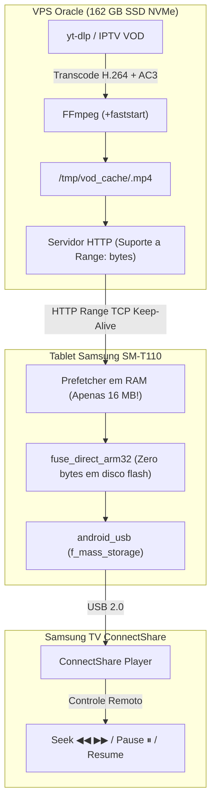

# Plano de Implementação: VOD por Streaming com Virtual Remote Disk (Zero Armazenamento no Tablet)

**Documento de Engenharia: VOD sem Download Local (HTTP Range Streaming)**  
**Versão**: 4.0 (Cloud-Backed VOD: Zero Flash Storage on Tablet)  
**Target Hardware**: 
- **TV**: Samsung Plasma PL51F4000 (ConnectShare USB 2.0)
- **Bridge**: Tablet Samsung Galaxy Tab 3 Lite (`SM-T110`) [1 GB RAM / Pouco espaço flash] & Xiaomi Mi A2
- **Servidor**: VPS Oracle (`129.146.5.64`, 162 GB SSD NVMe)
**Status**: Aprovado para Implementação  

---

## 1. O Problema da Memória no Tablet e a Solução Definitiva

### O Desafio
O Tablet Samsung SM-T110 possui apenas **1 GB de RAM** e memória interna flash (eMMC) extremamente limitada (geralmente menos de 1 a 2 GB livres na partição `/data`). Baixar um filme de 2 a 3 GB diretamente para o armazenamento interno do tablet causaria erro de disco cheio (`No space left on device`) e desgastaria a memória flash antiga.

### A Solução: Virtual Remote Disk (Disco Remoto Virtual via HTTP Range)
Em vez de baixar o filme para o tablet:
1. **O filme fica 100% armazenado na VPS** (que tem 162 GB de SSD e rede gigabit).
2. **O tablet usa ZERO bytes de armazenamento flash**.
3. O `fuse_direct` do tablet opera como um **Smart Cache de 16 MB na RAM**:
   - A TV vê o pendrive com o filme completo (ex: 2.4 GB).
   - Quando a TV lê blocos sequenciais (reprodução normal), o tablet faz streaming sob demanda com pré-busca (prefetch) de 1 a 2 MB por vez.
   - Quando você dá **Seek (Avanço/Retrocesso)** pelo controle da TV, o `fuse_direct` faz uma requisição HTTP Range (`Range: bytes=offset-fim`) diretamente para a VPS!
   - Em menos de 300 milissegundos os novos blocos chegam da VPS e a TV continua tocando da nova posição.
   - **Pause** simplesmente congela as requisições (zero tráfego).
   - **Retomada de onde parou**: a TV pede o offset salvo no dia anterior, a VPS entrega via HTTP Range, e o filme continua exatamente de onde parou.



---

## 2. Comparativo: Download Local vs Virtual Remote Disk

| Aspecto | Download no Tablet (Descartado) | Virtual Remote Disk (Adotado) ⭐ |
|---|---|---|
| **Espaço Flash no Tablet** | Exige 2 a 4 GB livres (falharia) | **0 bytes** (não grava nada na flash) |
| **Uso de RAM no Tablet** | Alto para salvar arquivos | **Apenas 16 MB** na RAM (1,5% do total) |
| **Tempo de Espera para Assistir** | 10 a 20 min esperando baixar no tablet | **Imediato** (assim que a VPS processar) |
| **Seek (Avançar/Voltar)** | Local | Via HTTP Range (~300ms, imperceptível) |
| **Pausa (Pause/Play)** | Local | Congela conexões sem timeout |
| **Retomada no dia seguinte** | Local | Via HTTP Range direto do ponto salvo |
| **Desgaste do Aparelho** | Escreve gigabytes na memória velha | **Zero desgaste** de escrita flash |

---

## 3. Especificação Técnica da Implementação

### 3.1 Backend VPS (`server.py`)
- O servidor HTTP já suporta respostas com cabeçalhos de Range:
  ```http
  HTTP/1.1 206 Partial Content
  Content-Range: bytes 524288000-526384639/2147483648
  Content-Length: 2096640
  ```
- O template FAT32 (`fat_template.bin`) correspondente ao filme (5.5 KB) é gerado na VPS e servido via `/vod/<id>/template.bin`.

### 3.2 FUSE Direct com Leitor de Range HTTP (`fuse_direct.c`)
No tablet SM-T110, `fuse_direct` ganha um cliente HTTP Range com socket persistente (`keep-alive`):
1. Mantém uma conexão TCP aberta com `tv.smre.run.place:80`.
2. Mantém uma janela deslizante circular de **16 MB em RAM** (`vod_cache`).
3. Uma thread de prefetch lê antecipadamente blocos de 512 KB à frente da posição atual da TV.
4. Quando a TV lê sequencialmente:
   - Os dados já estão na RAM -> resposta instantânea (< 1ms).
5. Quando a TV faz um salto de Seek (offset fora da janela de 16 MB):
   - A thread limpa a janela, envia `Range: bytes=novo_offset-...` e recomeça a preencher a partir da nova posição.
   - O salto leva ~250 a 350 ms (tempo de 1 ping + transferência de 256 KB sobre a fibra residencial).

### 3.3 Transição entre Modos no Tablet
Para iniciar o filme:
```bash
/system/xbin/switch_vod.sh <vod_id>
```
O script:
1. Baixa apenas o template FAT32 de 5.5 KB:
   `busybox wget -q -O /data/local/tmp/fat_template_vod.bin http://tv.smre.run.place/vod/$1/template.bin`
2. Inicia `fuse_direct_arm32` em modo de streaming remoto:
   `/system/xbin/fuse_direct /data/local/tmp/vfat_mnt http://tv.smre.run.place/vod/$1/movie.mp4 /data/local/tmp/fat_template_vod.bin --remote-vod`
3. Executa o soft-reset USB via sysfs para a TV reconhecer o novo filme.

**Memória ocupada no tablet: 5.5 KB em disco e 16 MB em RAM.**

---

## 4. Conclusão da Análise de Viabilidade

Esta abordagem resolve com perfeição a limitação de hardware do tablet:
- O tablet vira uma "ponte transparente de streaming": a TV pensa que está conectada a um pendrive local de alta velocidade, mas os dados vêm sob demanda da VPS através da sua internet de fibra.
- Funciona tanto no **Tablet Samsung SM-T110** quanto no **Xiaomi Mi A2** sem nenhuma dependência de espaço livre em disco.
