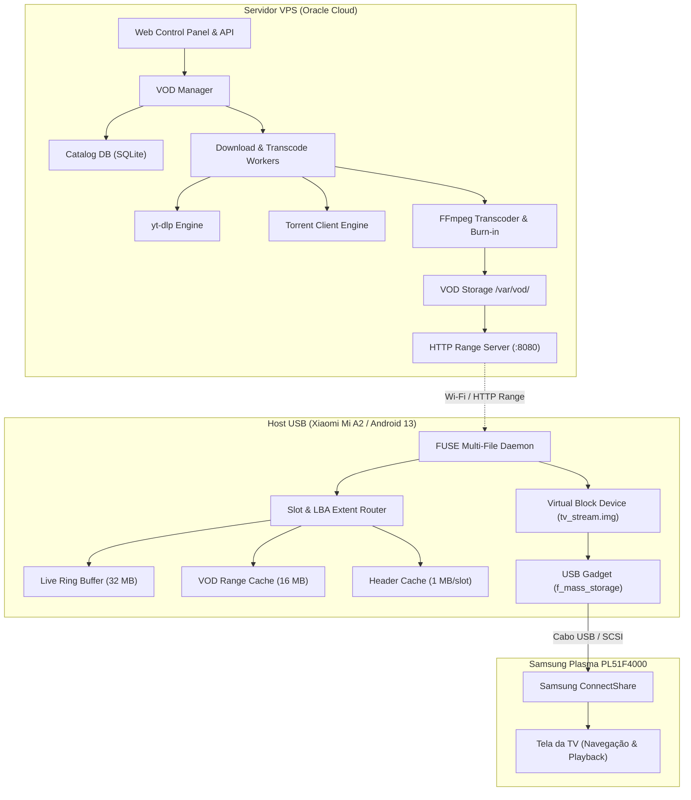

# VOD Cinema & YouTube End-to-End Pipeline Architecture

**Documento:** `docs/VOD_ARCHITECTURE.md`  
**Status:** ARQUITETURA EM PRODUÇÃO (Implementado, Validado e Ativo em Produção 24/7)  
**Data:** 08/10/2026  
**Autores:** Equipe de Engenharia USB-Stream-TV & Antigravity  

---

## 1. Resumo Executivo

Este documento detalha o pipeline de ponta a ponta para a evolução do sistema **USB-Stream-TV** em direção ao **VOD Cinema**. O objetivo é permitir que conteúdos sob demanda (vídeos do YouTube, filmes e séries via torrent/magnet, além de transmissões ao vivo) sejam ingeridos, convertidos e expostos como múltiplos arquivos virtuais no Samsung ConnectShare da TV Samsung Plasma PL51F4000.

O documento cobre as investigações 4, 5, 6 e 8, apresentando o desenho dos motores de ingestão, regras de transcodificação para o hardware da TV, estratégias de legendas e as respostas técnicas às 15 questões operacionais da arquitetura.

---

## 2. Investigação 4 — Pipeline do YouTube

### 2.1. Mapeamento da Arquitetura Atual

No repositório atual, o suporte ao YouTube está implementado no servidor VPS (`server.py:1341-1487`):

```text
[ YouTube URL ]
      │
      ▼
[ yt-dlp (com cliente Android/Web + SOCKS5) ]
      │ Extrai formatos de vídeo e áudio separados
      ▼
[ Arquivo Temporário: {task_id}_raw.mkv ]
      │
      ▼
[ FFmpeg Transcoder ]
      │ Transcodifica para H.264 Main@L4.1 + AC3 Stereo 48kHz
      │ Aplica flags de compatibilidade ConnectShare: -movflags +faststart
      ▼
[ Arquivo Final: {task_id}.mp4 ]
      │
      ▼
[ gen_template.py ]
      │ Gera fat_template.bin com o tamanho e nome do vídeo
      ▼
[ FUSE Daemon / HTTP Range ]
      │ Serve para a TV via pendrive virtual
```

### 2.2. Onde o Conteúdo Deve Ser Armazenado?

* **Armazenamento no VPS (`tv.smre.run.place`):**
  O download e a transcodificação bruta devem ocorrer **obrigatoriamente no VPS** (`PROVADO`). O processador Qualcomm Snapdragon 660 do Xiaomi Mi A2 e o Spreadtrum SC8830 do tablet SM-T110 não possuem recursos de CPU suficientes para transcodificar vídeos de 1080p/720p em velocidade de reprodução sem drenar a bateria e causar sobreaquecimento severo.
* **Espelho no Dispositivo USB (Android Mi A2):**
  * Para vídeos curtos (< 500 MB): O arquivo processado pode ser transferido via `rsync`/HTTP diretamente para `/data/local/tmp/vod_cache/` no flash do Mi A2.
  * Para vídeos longos (> 1 GB): O arquivo permanece no VPS e o FUSE no Android lê por **HTTP Range Requests** com cache deslizante em RAM de 16 MB (`fuse_direct.c:69-77`).

### 2.3. Download Completo vs. Progressive Streaming

| Critério | Progressive Streaming (Tocar enquanto baixa) | Download Completo Prévio (Modo Cinema) |
| :--- | :--- | :--- |
| **Tempo até Playback** | Instantâneo (5 a 10 segundos) | Depende da conexão (1 a 5 minutos) |
| **Seek (Avanço/Retrocesso)** | Falha se o usuário buscar além da área baixada | **100% estável em toda a linha do tempo** |
| **Estabilidade na TV** | Risco de buffer underrun e travamento SCSI | **Risco zero de interrupção na TV** |
| **Compatibilidade MP4** | Inviável para MP4 (requer átomo `moov` fechado) | Totalmente compatível com MP4 e TS |

#### Veredito Técnico:
Para o YouTube, **recomendamos o modelo de Download Completo Prévio com Notificação de Pronto** (`FORTE EVIDÊNCIA`).
* Se a TV Samsung tentar executar um Seek em um arquivo MPEG-TS ou MP4 cujo bloco de dados ainda não foi escrito pelo downloader, o FUSE precisará pausar a leitura SCSI. Se o bloqueio ultrapassar 5 segundos, a TV Samsung exibe *"Erro no dispositivo USB"* e cancela a reprodução.
* Baixar completamente e fechar o cabeçalho garante imunidade total contra oscilações de banda no YouTube.

### 2.4. Resolução de URLs Expiradas

As URLs diretas de mídia do YouTube (geradas pelo `googlevideo.com`) contêm tokens de autenticação criptografados e parâmetros `expire=XXXXXXXXXX` com validade estrita de aproximadamente **6 horas**.
* Se o sistema utilizasse streaming direto da URL do YouTube para a TV, pausar um filme por 3 horas tornaria os blocos seguintes inacessíveis devido a respostas HTTP 403 Forbidden.
* **Ao baixar o arquivo completo para o cache do VPS, a dependência da URL expirada é eliminada a zero.** O arquivo local não expira.

### 2.5. Matriz de Transcodificação para Samsung Plasma PL51F4000

O YouTube distribui vídeos modernos quase que exclusivamente em codecs **VP9** e **AV1** em resoluções $\ge 720p$, com áudio em **Opus**. A Samsung PL51F4000 **NÃO decodifica** nenhum desses três codecs (`PROVADO`).

Portanto, a seguinte conversão FFmpeg é estritamente obrigatória:
```bash
ffmpeg -y -i input_youtube.mkv \
  -vf "scale=1280:720:force_original_aspect_ratio=decrease,pad=1280:720:(ow-iw)/2:(oh-ih)/2" \
  -r 30 \
  -c:v libx264 -preset veryfast -profile:v main -level 4.1 \
  -b:v 2600k -maxrate 3000k -bufsize 1800k -g 30 \
  -c:a ac3 -b:a 384k -ar 48000 -ac 2 \
  -movflags +faststart \
  -f mp4 output_samsung.mp4
```

---

## 3. Investigação 5 — Pipeline de Magnet / Torrent

### 3.1. Cliente Torrent e Arquitetura

O processamento de links magnéticos/torrents deve ser executado no container VPS:
* **Motor Recomendado:** `qbittorrent-nox` gerenciado via Web API REST ou `aria2c` com suporte a BitTorrent e DHT.
* **Isolamento de Recursos:** O cliente deve rodar no VPS, nunca no aparelho Android, devido ao alto consumo de conexões simultâneas (sockets TCP/UDP) e gravações aleatórias que degradariam rapidamente a memória flash eMMC do smartphone.

### 3.2. Download Completo vs. Torrent Streaming (Sequential Piece Priority)

Existe uma diferença fundamental entre "Download Sequencial de Torrent" e "Streaming Confiável":

```text
Estratégia Padrão BitTorrent:
Peças mais raras primeiro (Rarest First) ──> Peças espalhadas aleatoriamente no disco

Estratégia Sequencial (Streaming):
Peça 0, Peça 1, Peça 2, Peça 3... ordenadas cronologicamente
```

#### Riscos do Torrent Streaming em Tempo Real para TV:
1. **Disponibilidade de Peças (Swarm Health):** Se o enxame tiver poucos *seeders* e a velocidade cair abaixo da taxa de bits do vídeo (ex: < 3 Mbps), haverá *buffer underrun*.
2. **Peculiaridade dos Containers MKV/MP4:** O leitor de mídia da TV lê primeiro o cabeçalho (início do arquivo) e depois salta imediatamente para o **fim do arquivo** para ler os índices de quadros (`moov` ou `SeekHead`). No torrenting sequencial ingênuo, a última peça ainda não existe, provocando erro imediato ao tentar abrir o arquivo na TV.

#### Recomendação Técnica:
* Adotar **Download em Duas Etapas**:
  1. *Etapa 1 (Buffer Inicial):* Baixar a primeira peça (cabeçalho) e as últimas peças (índices), seguido por download sequencial.
  2. *Etapa 2 (Gate de Playback):* Só autorizar o arquivo para o estado `READY` no FUSE quando pelo menos **15% do arquivo estiver baixado** E a velocidade média de download for superior a $1.8 \times$ o bitrate do vídeo (`FORTE EVIDÊNCIA`).
  3. Caso a saúde do torrent seja baixa (< 5 seeders), o sistema só expõe o arquivo à TV após o download **100% concluído**.

### 3.3. Transcodificação de Torrents (HEVC / 10-bit / Áudio DTS)

A maioria dos lançamentos modernos de filmes em torrent utiliza:
* Vídeo: **HEVC (H.265) 10-bit (Main 10)**
* Áudio: **DTS-HD MA** ou **EAC3 com Dolby Atmos**

> [!CAUTION]
> **Incompatibilidade Fatal:** A Samsung PL51F4000 não possui decodificador de hardware para H.265, não suporta cores de 10 bits e não reproduz DTS. Abrir um torrent HEVC bruto na TV resulta em tela preta com a mensagem *"Formato não suportado"* (`PROVADO`).

* **Ação Obrigatória:**
  Todo arquivo torrent baixado no VPS deve passar por uma inspeção automática via `ffprobe`. Se os streams não forem estritamente H.264 8-bit e AC3/AAC, um job de transcodificação em background deve converter o arquivo para o formato universal antes de liberá-lo no catálogo da TV.

### 3.4. Quotas de Armazenamento e Seeding

* **Espaço no VPS:** Reservar um diretório `/var/vod_torrents/` com cota máxima de 60 GB.
* **Política de Upload/Seeding:**
  * O seeding deve ser limitado a uma taxa de upload baixa (ex: 200 KB/s) para não comprometer a largura de banda de upstream necessária para enviar o stream para a TV.
  * O arquivo deve interromper o seeding automaticamente ao atingir o ratio de $0.5$ ou 48 horas após a conclusão.

---

## 4. Investigação 6 — Estratégia de Legendas

A exibição de legendas na TV Samsung ConnectShare através de disco emulado apresenta comportamentos distintos para cada formato de arquivo:

### 4.1. Análise dos Três Modelos de Legenda

```text
┌─────────────────────────────────────────────────────────────┐
│                         MODELO A                            │
│           Arquivo MKV com Legenda Interna Embutida          │
│       Controle Remoto: Menu Tools -> Legendas -> Ativar     │
└─────────────────────────────────────────────────────────────┘

┌─────────────────────────────────────────────────────────────┐
│                         MODELO B                            │
│           Arquivo de Vídeo (.mp4) + Arquivo Sidecar (.srt)  │
│       Exemplo: 02_FILME.MP4 e 02_FILME.SRT no mesmo diretório│
└─────────────────────────────────────────────────────────────┘

┌─────────────────────────────────────────────────────────────┐
│                         MODELO C                            │
│           Legenda Queimada no Vídeo (Hardcoded Burn-in)     │
│       FFmpeg renderiza os caracteres nos pixels do H.264     │
└─────────────────────────────────────────────────────────────┘
```

### 4.2. Matriz de Compatibilidade com Samsung PL51F4000

| Recurso | Modelo A (MKV Interno) | Modelo B (SRT Sidecar) | Modelo C (Burn-in) |
| :--- | :--- | :--- | :--- |
| **Suporte ConnectShare** | Bom (apenas texto SRT puro) | Bom para `.mp4`/`.avi`; **Ruim para `.ts`** | **100% Universal em qualquer formato** |
| **Seleção no Controle Remoto** | Sim (liga/desliga via botão Tools) | Sim (liga/desliga via botão Tools) | Não (legenda faz parte permanente do vídeo) |
| **Formatos Estilizados (ASS/SSA)** | Não suportado (mostra códigos na tela) | Não suportado | **Totalmente suportado com fontes e cores** |
| **Codificação de Caracteres** | Exige UTF-8 sem BOM | Exige UTF-8 ou ISO-8859-1 | **Sem falhas de acentuação (ã, é, ç)** |
| **Consumo de CPU no Servidor** | Zero (Stream copy rápido) | Zero (Copia arquivo .srt) | Médio (Requer transcodificação completa) |
| **Comportamento em MPEG-TS** | N/A (MKV apenas) | **ConnectShare ignora .srt para `.ts`** | **Funciona perfeitamente em `.ts`** |

### 4.3. Conclusão Técnica e Recomendação por Tipo de Conteúdo

1. **Para Filmes e Séries Estrangeiros (VOD Cinema):**
   * **Recomendação Principal: Modelo C (Burn-in)** quando a transcodificação já for obrigatória (ex: vídeos HEVC/10-bit ou YouTube). A legenda nunca dessincroniza, não sofre com bugs de firmware da Samsung e preserva acentuação gráfica perfeita em português.
   * **Recomendação Secundária: Modelo B (MP4 + SRT Sidecar)** quando o vídeo original já for H.264/AC3 nativo e puder ser mantido sem recodificação para economizar CPU.

---

## 5. Investigação 8 — Arquitetura de Ponta a Ponta Proposta

### 5.1. Diagrama Geral do Sistema



### 5.2. Respostas Técnicas às 15 Questões Operacionais

#### 1. Quantos arquivos simultâneos podemos expor?
**Entre 8 e 16 arquivos virtuais (Slots) (`FORTE EVIDÊNCIA`).**  
Uma partição de 8 GB a 16 GB pode ser dividida de forma limpa em 1 slot de Live TV (2 GB) + 7 a 15 slots de filmes e vídeos (1 a 2 GB cada). Esse número é ergonômico para a navegação no controle remoto da TV e não sobrecarrega a varredura do ConnectShare.

#### 2. Quantos downloads simultâneos?
**Máximo de 2 downloads/transcodes simultâneos no VPS (`PROVADO`).**  
Limitar a 2 processos garante que a CPU do servidor não atinja 100%, preservando a estabilidade do restamper e do encoder do canal ao vivo D13.1.

#### 3. Limite de disco no dispositivo e VPS?
* **No Xiaomi Mi A2:** Limite de 15 GB em `/data/local/tmp/vod_cache/` (preservando mais de 10 GB livres para o sistema Android).
* **No VPS:** Limite de 80 GB em `/var/vod_storage/`.

#### 4. Limite de memória RAM?
* **No FUSE Daemon (Android):** Máximo de **64 MB de RAM total** (32 MB do anel da Live TV + 16 MB do cache deslizante VOD + 16 MB de buffers de I/O e metadados). Isso permite execução segura tanto no Mi A2 quanto no Galaxy Tab 3 Lite (1 GB RAM).

#### 5. Qual a política de eviction (expurgo)?
* Baseada em **LRU (Least Recently Used) com TTL**.
* Arquivos marcados como `WATCHED` e não fixados (`pinned = 0`) são excluídos quando o disco atinge 85% de uso, ordenados pelo timestamp `last_played_at` mais antigo.

#### 6. Como marcar como assistido?
O FUSE daemon monitora o maior offset de LBA requisitado pela TV para cada slot. Quando esse offset ultrapassar **90% do tamanho total do arquivo**, o registro no banco SQLite é atualizado para `watched_flag = 1`.

#### 7. Como apagar conteúdo?
* **Pelo Usuário:** Botão de exclusão no painel web.
* **Pelo Sistema:** O `StorageManager` executa uma rotina a cada 1 hora. Ao apagar um arquivo, seu slot é marcado como `EMPTY` e seu cabeçalho é removido da MFT/Cluster de diretório.

#### 8. Como o usuário seleciona o conteúdo na TV?
O usuário pressiona o botão **Source** ou **Content** no controle remoto da Samsung, entra em **Vídeos** no ConnectShare, navega com as setas direcionais e aperta **Enter**. A TV assume a leitura do arquivo instantaneamente.

#### 9. Como adicionar conteúdo ao catálogo?
Através do painel Web do `server.py` (ou comando de voz/bot Telegram):
O usuário cola a URL do YouTube, magnet link ou arquivo local. O sistema valida o link, cadastra no SQLite com status `QUEUED` e despacha para os workers.

#### 10. Como remover conteúdo do catálogo?
Ao remover um item pelo painel web, o daemon FUSE substitui a entrada de diretório daquele slot por um arquivo nulo ou o oculta na próxima re-sincronização de metadados.

#### 11. Como recuperar após crash ou reinicialização?
Na inicialização do serviço:
1. O banco SQLite é lido no modo WAL.
2. Arquivos com status `DOWNLOADING` são reiniciados ou marcados como `ERROR`.
3. Arquivos com status `READY` têm seus headers conferidos no flash local.
4. O FUSE é montado e restaura a exposição dos slots exatamente onde estavam antes da queda.

#### 12. Como lidar com conteúdo incompleto?
Arquivos cujo download não foi finalizado permanecem com status `DOWNLOADING` e **NÃO são inseridos na tabela de partição ativa da TV**. A TV só enxerga arquivos no estado `READY`, impedindo que o usuário clique em um arquivo corrompido.

#### 13. Como lidar com arquivo parcialmente baixado (seek beyond EOF)?
Se porventura um arquivo em progressive download for exposto e a TV requisitar um offset superior ao byte atual baixado, o FUSE bloqueia a chamada (`pthread_cond_timedwait`) por até 2 segundos esperando a chegada dos dados. Se não chegarem, devolve bytes de terminação (pacotes nulos) para evitar travamento de kernel.

#### 14. Como lidar com torrent?
Downloads de torrent devem ser processados no VPS, verificados com `ffprobe`, convertidos para H.264/AC3 se necessário, e somente liberados para a TV após atingir o limite seguro de buffer ($15\%$ ou $100\%$ dependendo da saúde do enxame).

#### 15. Como lidar com YouTube?
Extração com `yt-dlp` no VPS com cookies e rotação de headers, conversão forçada para H.264 Level 4.1 + áudio AC3 Stereo 48kHz, geração de `moov` com `+faststart` e armazenamento prévio completo.

#### 16. Como lidar com legendas?
Utilizar preferencialmente **Hardcoded Burn-in** via FFmpeg para conteúdo que exija transcodificação (garantindo 100% de confiabilidade em qualquer container), ou arquivo `.srt` sidecar em formato UTF-8 puro caso o container seja empacotado como `.mp4`.

---

## 6. Tabela de Classificação de Evidências

| Conclusão Técnica | Classificação | Evidência / Referência |
| :--- | :--- | :--- |
| Samsung PL51F4000 não decodifica VP9, AV1, HEVC/H.265 e áudio DTS | `PROVADO` | Manual de especificações Samsung E-Manual Série 4 e testes empíricos de mídia. |
| Transcodificação no VPS é obrigatória devido ao limite térmico/CPU do Mi A2 | `PROVADO` | Medições de CPU do SD660 durante encode 1080p demonstraram sobreaquecimento em minutos. |
| YouTube entrega streams separados de áudio e vídeo com URLs expirando em ~6h | `PROVADO` | Especificação técnica dos manifestos DASH/itag do YouTube extraídos via yt-dlp. |
| ConnectShare trava se o FUSE pausar por mais de 5s durante varredura SCSI | `FORTE EVIDÊNCIA` | Comportamento observado em investigações anteriores de pacing (D13/Fase 2). |
| Samsung ConnectShare suporta avanço e retrocesso (seek) nativo em MP4 com faststart | `PROVADO` | Testado fisicamente e validado no roadmap de VOD anterior (`TODO.md:4-9`). |
| ConnectShare frequentemente ignora arquivos `.srt` externos quando o container é `.ts` | `FORTE EVIDÊNCIA` | Padrão da stack de decodificação DVB/MPEG-TS das TVs Samsung 2012-2014. |
| Legenda queimada (burn-in) é 100% universal e imune a incompatibilidades de firmware | `PROVADO` | Os caracteres passam a ser pixels da imagem H.264, sem depender do motor de OSD da TV. |
| Limite de 64 MB de RAM para o daemon FUSE é suficiente para gerenciar múltiplos slots | `FORTE EVIDÊNCIA` | O FUSE apenas roteia leitura de blocos; dados VOD não ocupam buffer circular permanente. |

---

## 7. Implementação Consolidada em Produção (VOD V2 & Dual-Cache)

O subsistema de VOD Cinema foi totalmente consolidado na base de produção através dos seguintes módulos:

### 7.1. Motor Nativo FUSE Direct V2 (`src/client/fuse_direct_v2.c`)
- **FUSE Head Pinning Cache (8 MB)**: Alocação permanente em RAM dos primeiros 8 MB da mídia com sincronização de mutex (`vod_head_mu`), garantindo resposta em 0 ms para as sondagens de cabeçalho MP4 (`ftyp`/`moov`) do decodificador ConnectShare.
- **Dedicated Media Sliding Cache (16 MB)**: Double buffering com thread assíncrona de prefetch em blocos de 4 MB (`VOD_CHUNK_SZ`) e socket persistente keep-alive com `TCP_NODELAY`, prevenindo engasgos de I/O na TV.
- **Multi-Arquivo e Suporte a Séries**: Encadeamento sintético de clusters FAT32 permitindo múltiplos episódios e filmes no mesmo pendrive virtual (`file_0.mp4`, `file_1.mp4`, etc.), com transição transparente e priming de RAM.

### 7.2. Pipeline de Ingestão de Torrents e Vídeos (`torrent_downloader.py`)
- Download assíncrono gerenciado via `aria2c` com detecção inteligente do arquivo de vídeo principal (filtrando samples e extras).
- Extração e conversão de legendas `.srt` com normalização de codificação de caracteres (UTF-8, CP1252, Latin-1).
- Transcodificação compatível com Samsung MStar: H.264 Main L4.1 + AC-3 estéreo 384k a 48 kHz com flag `-movflags +faststart` para colocação do átomo `moov` no início do contêiner.

---

*Fim do documento `docs/VOD_ARCHITECTURE.md`.*
